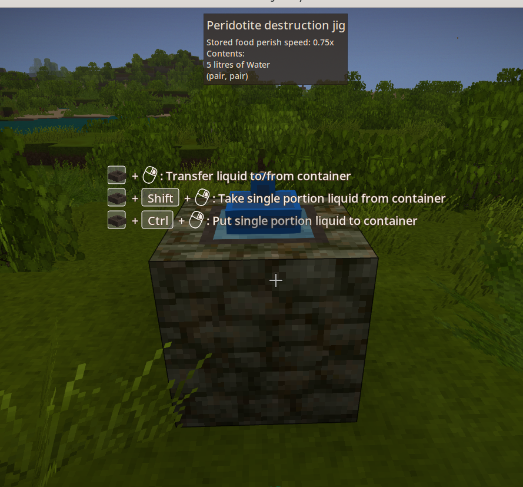

This page explains how to play the mod after it is correctly installed. The
client side does not need Coq installed. However, if you are running a server,
or playing in single player mode, Coq must be installed, as explained on the
[readme page](readme.md).

These are the items that are not solely involved with crafting terms:
* Primitive term storage - a basket that can be crafted in the stone age and is big as a chest, but only holds terms.
* Enhanced pan - has a 100% greater chance of dropping copper nuggets (about
  30% total) and a 200% greater chance of dropping sphalerite nuggets (6%
  total). Needs `(3, 12, 5)` term to craft.
* Lambda tree seed - grows into a tree with bluelish colored logs. It can be
  used for decoration, or its sap can be processed into term destruction fluid,
  which is necessary to craft some terms. The trees can rarely be found in the
  world, or the seed can be crafted using a walnut seed and the term `(pair, S)`.
* Blue clay transformer - right click this on a blue clay block in the world to
  slowly convert it and its neighbors into fire clay blocks.
* Metal glue - can be used to repair tools in the crafting grid. Using metal
  glue on a tool saves the hassle smithing, and repairing a tool overall costs
  half the metal. Requires term `inl 3 :: inr (2, tt) :: nil` to craft.

The first time you will want to make is the primitive term storage. After that,
the enhanced pan and lambda tree seeds are early game items, because their
required terms on the application jig with input terms found in the early game.

There is also a recipe to duplicate tree seeds, which can be used early game.
However, the recipe is somewhat involved. So it's only worth copying tree seeds
that are somewhat rare. Also a tree seed can only be copied once. Seeds
harvested from a tree can be copied, whether or not the tree was grown from a
copied seed.

The blue clay converter and metal glue are mid game items. Building their terms
requires both the application jig and destruction jig. The destruction jig
doesn't work without destruction fluid, which requires a barrel and lambda tree
sap to craft.

## Function application crafting

This is the mod's early game form of crafting. Many of the term objects are
functions, and the application jig allows combining them together to create new
terms.

The screenshot above shows the application jig on the bottom. It is the main
block used to perfom the function application. The jig is created with stones
and clay, similar to, but with a slightly different recipe than cobblestone.

The mod adds terms items (currently all blue colored in the shape of a spinning
top) which represent functions or arguments to functions. The application jig
combines two terms together to make a new term. The first term must be a
function (called the applicand). The player right clicks it into place.
The second term (called the argument) must have a type that matches what the
function accepts. It is also right clicked into place. If the argument
has the correct type, then it will stay poking out the top of the jig. If it
has the wrong type, then it will quickly fall out of the jig. Both terms can be
removed by right clicking with an empty hand.

Early game, you will find functions like these:
* `fst` - Takes an argument in the form (A, B) then returns the first element (the A)
* `snd` - Takes an argument in the form (A, B) then returns the second element (the B)
* `pair 3` - Takes any argument -- let's call it A -- and produces (3, A)
* `S` - Adds 1 to a number
* `pair` - Creates terms of the form (A, B). Put the function in the jig with its first argument, then apply them. It will produce a new function, which remains in the jig. Put the second argument in the jig and apply it.
* `hd` - Returns the first element of a list (something in the form `A :: B :: C :: nil`).
* `nth` - Returns the nth element of a list. It takes 3 arguments:
  * 0-based index of which element to take from the list (the left most element is 0)
  * The list to take the element from
  * A default value to return if the index is out of bounds. The default value must match the type of the rest of the elements in the list. For example, if the list was `4 :: 0 :: 0 :: 5 :: 3 :: nil`, then 12 would be a good default argument, because it is a number like the rest of the elements in the list.

There are two ways to trigger the application. The first way is to the jig with
a hammer twice (hold left click). The terms that were in the jig will
disappear, and instead the result of the application will be in the bottom of
the jig. Right click to take it out.

The first way to trigger the application is only available if you have the metal necessary to make a hammer. So there is another way to trigger it in the early game: drop crafting.
1. Place two grooved cobblestone blocks to the side of the jig and 1 to 2 blocks above. Grooved cobble stone has a similar recipe to regular cobblestone (takes clay and stones).
2. While holding 3 or more sticks in your hotbar, right click the inner edge of one of the grooved cobblestone blocks. The 3 sticks will be placed between the grooved cobblestone blocks as a support for the next block.
3. Right click the stick support with a cobblestone slab. The slab will be placed on top of the sticks.
4. Place 3 sand or gravel blocks on top of the supported cobblestone slab. When the 3rd sand/gravel block is placed, the sticks supporting the slab will break, causing the slab and sand to come falling down. The slab breaks on impact with the application jig. If the application jig contained two terms, the impact of the slab falling will have caused them to get combined.

## Gathering terms

Besides combining terms in the application jig, terms can be gathered in the following ways.
* Harvesting reeds or papyrus - `fst`
* Killing drifters - `snd`
* Panning sand/gravel - `snd`
* Breaking non-branchy leaves - `(pair 3, S)`
* Harvesting mushrooms - `(pair, pair)`
* Breaking boulders - `S` and `12`
* Harvesting wolves - `4 :: 0 :: 0 :: 5 :: 3 :: nil`
* Harvesting hares - `hd` and `nth`
* Harvesting hyenas - `(fst, pair)`
* Breaking rocks - `inl tt` and `inr nil`
* Breaking seaweed - `inr tt :: inr tt :: inr tt :: inl 4 :: nil`
* Breaking clay blocks - `Nat.even`
* Breaking forest floor - `pair :: nil`

You will need a variety of terms to process and craft the reward items.
However, if you end up with too many or the wrong kinds, you can cook them into
denatured terms in a firepit, then eat them. Although the denatured terms only
provide a little bit of fruit satiety.

## Lambda tree

The lambda tree can be found in the world near acacia trees. Its distinguishing
features are its bluelish logs, and its upward curving branches.

Or instead of exploring to find it, its seed can be crafted from a walnut seed
plus the term `(pair, S)`.

The lambda tree sap's necessary for making destruction fluid. If the A Culinary
Artillery mod is installed, then the sap can be obtained by putting a spile on
the tree and a bucket below the spile. Alternatively, the tree logs can be
sealed in a barrel with water to make the sap (similar to the tannin recipe).
To make the destruction fluid, denatured terms need to be sealed in a barrel
with the tree sap.

## Destruction jig

The destruction jig allows one to break apart terms into a constructor and its
arguments. The input term must be an inductive type. The constructor is a very
pure form of a term. This is the only way of obtaining some of the constructors.

The destruction jig recipe is easy. It is crafted from stones, clay, and a
cooking pot. However, the jig cannot be used without destruction fluid, as
explained above, getting destruction fluid requires access to a lambda tree and
a barrel.

To use the jig, first right click destruction fluid into the pan on top. It
takes 5L (half a bucket). Then right click a term into the pan. If the term is
not an inductive type, then the destruction fluid will turn red but will not be
consumed. The incorrect term can be right clicked out with an empty hand. If
the term is an inductive type, then the destruction fluid will turn into water.
The term can either be destructed using a hammer, or by dropping a cobblestone
slab on top, like with the application jig.

Here are some examples of what can be destructed:
* `inl tt` -> `inl` and `tt`
* `inr nil` -> `inr` and `nil`
* `inr tt :: inr tt :: inr tt :: inl 4 :: nil` -> `cons`, `inr tt`, and `inr tt :: inr tt :: inl 4 :: nil`

## Inscription crafting

The blocks necessary to perform inscription crafting are currently only
available in creative mode. So until the recipes and full directions are
complete, inscription crafting should be considered a preview feature for
adventurous players.

The screenshot above shows solution for an inscription recipe that requires a
`forall A B, A*B -> B*A` function. The input item for the inscription recipe
was placed in the function block. The function block shows the function type on
its label on top.

The blue outline connecting the function block shows the scope of the function.
The function type indicates that the function takes 3 parameters: `A`, `B`, and
`A*B`. So within the function scope are 3 parameter ports. They were placed by
taking the "Out port" and right clicking it onto the blue scope face. There is
also a result port for the function, placed by right clicking an "In port" on a
blue scope face. The result expression of the function was connected to the
result port.

The parameter ports are ordered left-to-right then top-to-bottom (if there were
multiple lines of parameters). The 3rd parameter is connected to the input port
of a match block, and the output of the match block is connected to the result
port for the function.

The match block has one case block. The case block's label shows that it
contains the pair constructor. The `pair` constructor was chosen, because that
is the constructor for `A*B`. The case's scope is shown in orange. The case
scope has two parameter ports to match the two parameters of the `pair`
constructor. It also has a result port.

Inside the case statement are two application blocks. The left-most one gets
its applicand (the function it applies) from its inventory. This is represented
by the label on top of the block. Application blocks need both an applicand and
an argument. The first application block gets its argument from its port on its
backside, which is connected to the `B` parameter of the case scope. The `pair`
constructor takes two arguments. The function is curried, which means after the
first argument is applied, a new function is returned. This partially applied
function is connected to the applicand port of the second application block.
The second application block applies the `A` parameter of the case scope. The
result of the second application has the correct result type, so its result is
connected to the case result.

Right clicking the function block brings up a dialog. When "Inscribe" is
clicked in the dialog, the mod transpiles the block-based visual program into
the following Coq program, then calls `coqc` to verify it is correct, and
matches the type specified by the recipe. If all of that matches, then the
input item is replaced with the output item from the recipe.

Try completing the recipes listed in the
`resources/assets/lambda/recipes/inscription/cobblestone.json` file. The
recipes are listed in order by increasing difficulty.
