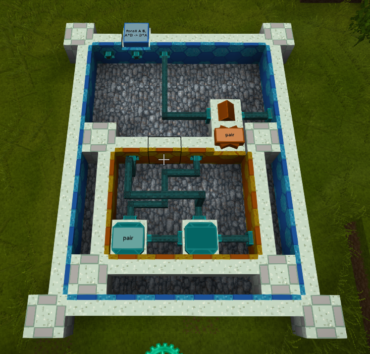

# Lambda - Coq logic puzzle mod

This is a mod for the Vintage Story video game. The mod has inscription recipes where input items are transformed into output items. Along with providing the correct input item, the player must also build a function that matches the function type specified in the inscription recipe. The functions are built with a visual programming language that compiles into Coq.



The screenshot above shows solution for an inscription recipe that requires a `forall A B, A*B -> B*A` function. The input item for the inscription recipe was placed in the function block. The function block shows the function type on its label on top.

The blue outline connecting the function block shows the scope of the function. The function type indicates that the function takes 3 parameters: `A`, `B`, and `A*B`. So within the function scope are 3 parameter ports. They were placed by taking the "Out port" and right clicking it onto the blue scope face. There is also a result port for the function, placed by right clicking an "In port" on a blue scope face. The result expression of the function was connected to the result port.

The parameter ports are ordered left-to-right then top-to-bottom (if there were multiple lines of parameters). The 3rd parameter is connected to the input port of a match block, and the output of the match block is connected to the result port for the function.

The match block has one case block. The case block's label shows that it contains the pair constructor. The `pair` constructor was chosen, because that is the constructor for `A*B`. The case's scope is shown in orange. The case scope has two parameter ports to match the two parameters of the `pair` constructor. It also has a result port.

Inside the case statement are two application blocks. The left-most one gets its applicand (the function it applies) from its inventory. This is represented by the label on top of the block. Application blocks need both an applicand and an argument. The first application block gets its argument from its port on its backside, which is connected to the `B` parameter of the case scope. The `pair` constructor takes two arguments. The function is curried, which means after the first argument is applied, a new function is returned. This partially applied function is connected to the applicand port of the second application block. The second application block applies the `A` parameter of the case scope. The result of the second application has the correct result type, so its result is connected to the case result.

## Missing features

This mod is in early access. It is still missing the following features:
1. A primitive application block that invokes functions without have to build a full function scope.
2. A primitive destruct block to introduce the player to the concept of `match` without having to build a full match with cases in a function scope.
3. Handbook entries or maybe a wiki. For now, look at the recipe descriptions. Try solving the inscription recipes in the order listed in the `en.lang` file.
4. Recipes to obtain the lambda blocks (can only be accessed in creative mode currently).
5. Drops or recipes to obtain the constructor and type items (can only be accessed in creative mode currently).
6. Balanced inscription recipes.
7. A few reward items (maybe a slightly more powerful axe?) to motivate the player to solve the puzzles.
8. Puzzle/function block breaks the solution blocks upon a successful inscription, to stop the player from spamming the inscription recipe, and to force the player to learn through some repetition.
9. A way to inspect the type of ports while building a function.
10. Better translation of Coq errors into block locations.
11. Inscription sound effects.
12. Puzzles that check not just the output type but the term produced by the function.
13. Fixpoints.

## Building

The `VINTAGE_STORY` environment variable must be set before loading the project. It should be set to the install location of Vintage Story (the directory that contains VintagestoryLib.dll).

Some of the unit tests invoke `coqc` (part of a Coq install). So Coq must be installed for all of the unit tests to run. It is also required to run the server side of the mod (but not required on the client side). The tests and mod search the following locations for coqc:
1. The location specified with the CoqcPath option in serverconfig.json (mod only).
2. The COQC environment variable. If used, this should be the complete filename of coqc.
3. `coqc` or `coqc.exe` in all folders in the `PATH` environment variable.

A Visual Studio Code workspace is included. The mod can be built through it.

### Release build from command line

This will produce a zip file in a subfolder of `bin/Release`.
```
dotnet build -c Release
```

### Debug build from command line

This will produce a zip file in a subfolder of `bin/Debug`.
```
dotnet build -c Debug
```

### Run unit tests

```
dotnet test -c Debug --logger:"console;verbosity=detailed"
```

### Run unit tests with graphviz output

```
dotnet test -c Debug --logger:"console;verbosity=detailed" -e GRAPHVIZ=1
```
